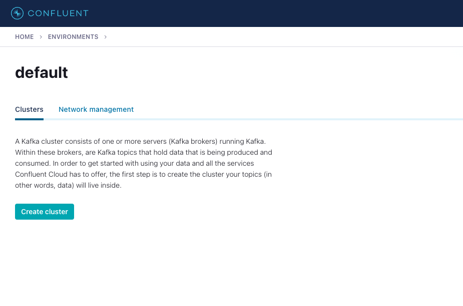
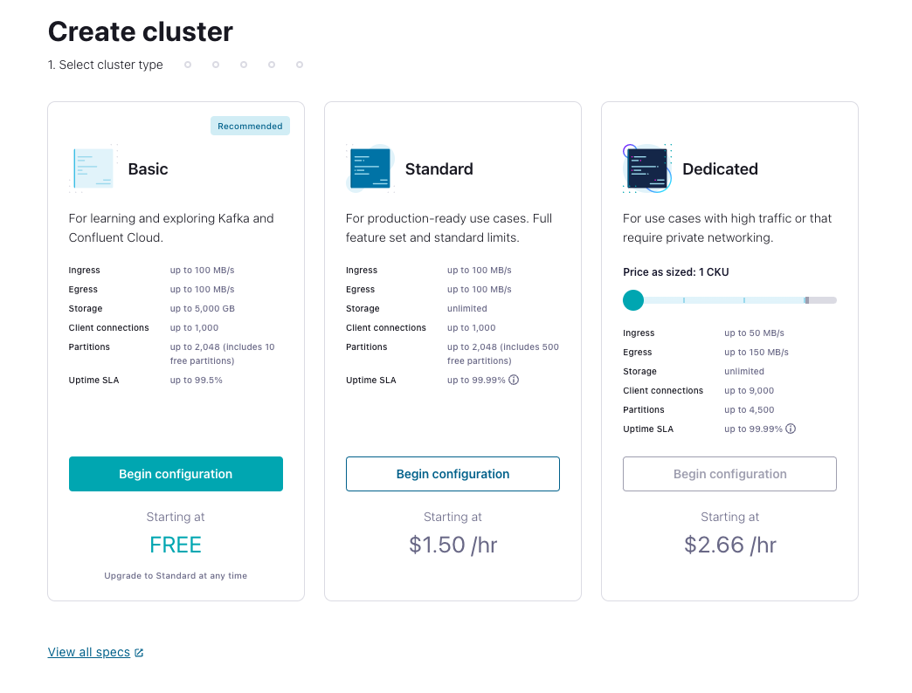
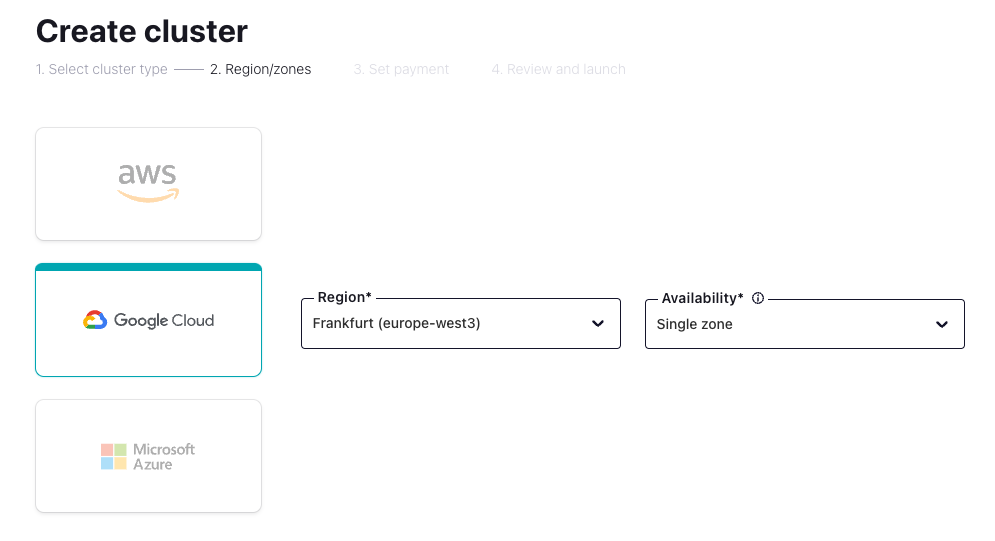
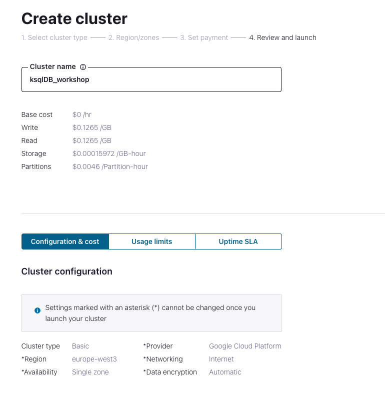
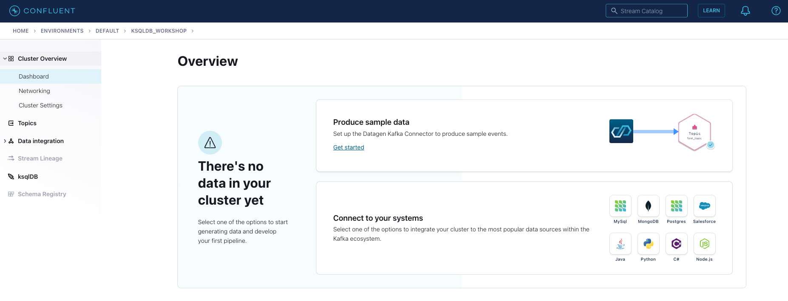
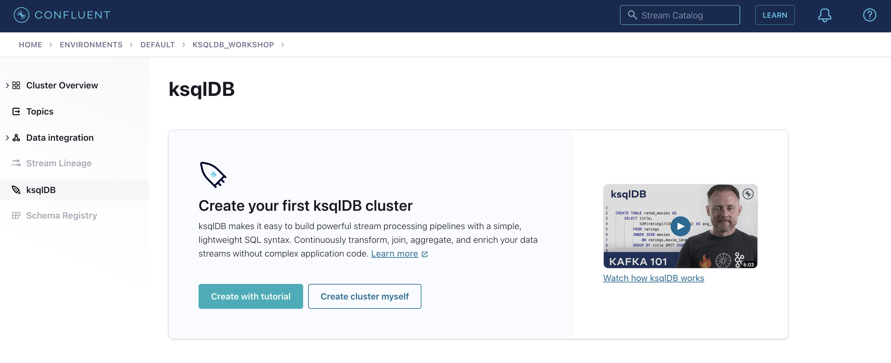
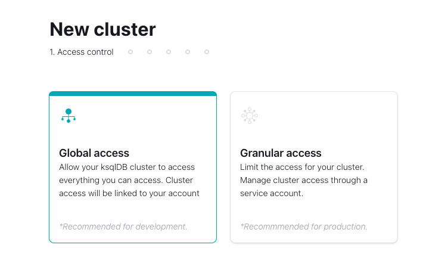
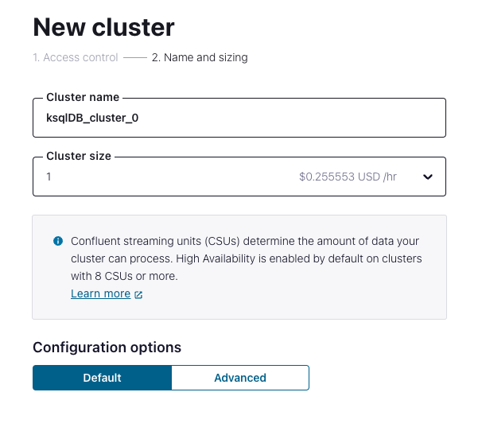
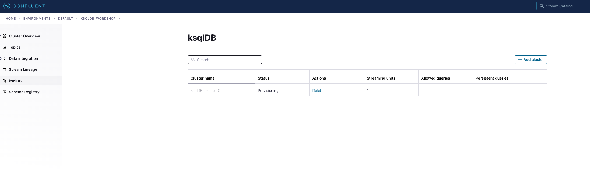

# Set up Confluent Cloud for ksqlDB Hands-on Workshop

## 1. Sign in to [Confluent Cloud](https://confluent.cloud/login)
- If you do not have an account you can [sign up here](https://confluent.cloud/signup)
- If you need additional balance credit navigate to the [Billing & payment](https://confluent.cloud/settings/billing/payment) page and use the following Promo Codes: CLOUD300, KAFKA101

## 2. Create a Kafka cluster
- Navigate to your [environments](https://confluent.cloud/environments) and select one
- Click **Create Cluster** if this is the first cluster in your environment, or click **Add cluster** if your environment has existing clusters

- Click **Begin configuration** with **Basic Cluster**

- Select Cloud provider, region and Single zone availability

- If the **Set Payment** step appears, click **Skip Payment**
- Lastly, set the Cluster name, review Cluster configuration and click **Launch cluster**

- Once the cluster has provisioned, the **Cluster Overview** page displays. Now you can get started configuring apps and data on your new cluster.

## 3. Create a ksqlDB cluster
- Click **ksqlDB** in the navigation menu

- Click **Create cluster myself**. On the **New cluster** page, ensure that **Global access** is selected, and click **Continue**.

- On the **Configuration** page, enter `ksqlDB-cluster-0` for the **Cluster name**. In the **Cluster size** dropdown, select 1 and keep the configuration options in default state.

- Click **Launch cluster!**. The ksqlDB clusters page opens, and the new cluster appears in the list. The new cluster has a **Provisioning** status. It may take a few minutes to provision the ksqlDB cluster. When the ksqlDB cluster is ready, its **Status** changes from **Provisioning** to **Up**.

## Optional: Install Confluent CLI
- Download the CLI from https://docs.confluent.io/confluent-cli/current/install.html and follow the steps described or
- Execute `curl -sL --http1.1 https://cnfl.io/cli | sh -s -- latest` to download and install the latest version in the default directory.
