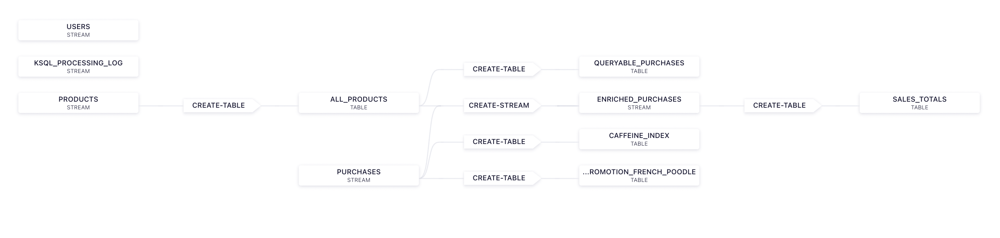
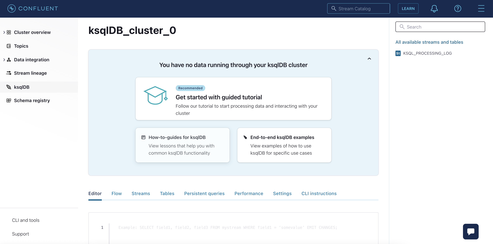
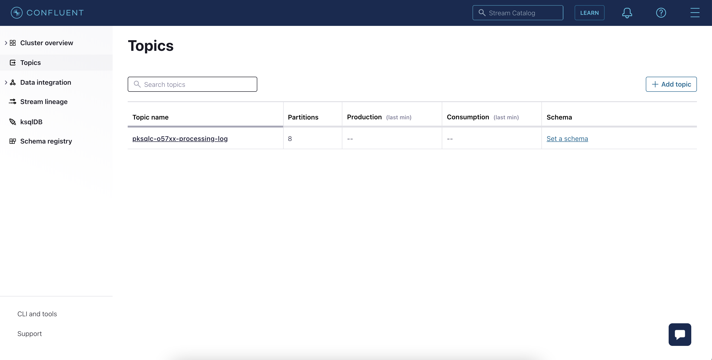
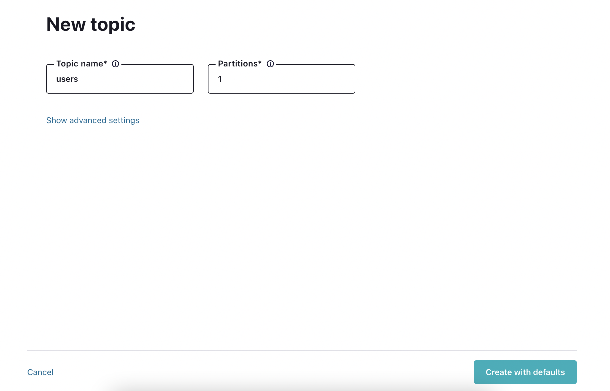
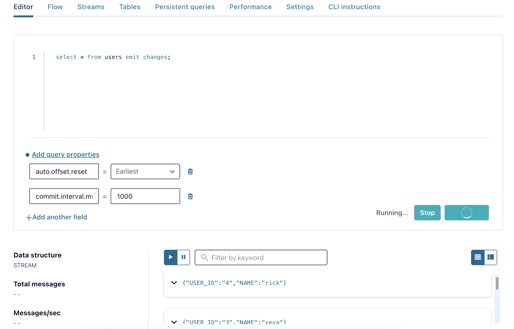
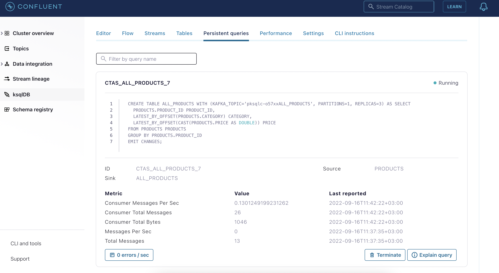
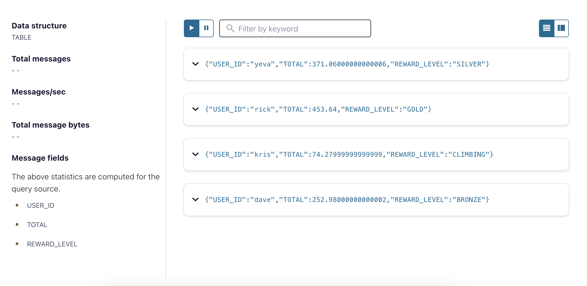

# Financial services case: Customer Loyalty Program (steps for Confluent Cloud)

We are going to build data pipeline which should look like this:


## 1. First Steps
- Login to Confluent Cloud.
- Select environment "ksqldb-workshop" and then select your Cluster.
- From the left panel select "ksqlDB" to display all apps.
- Select your ksqlDB cluster to display the ksqlDB Editor.



Check the properties set for the ksqlDB cluster:
```
show properties;
```

## 2. Create Topics

- Click the **Topics** in the navigation menu. The Topics page appears.
- If there aren’t any topics created yet, click **Create topic**. Otherwise, click **Add a topic**.



- Specify your topic details and click **Create with defaults**.
- Create the following topics:
  1. Topic name: ```users``` , Partitions: 1

     
  2. Topic name: ```products```, Partitions: 1
  3. Topic name: ```purchases```, Partitions: 1

- Go to **ksqlDB** from the navigation menu and verify the created topics with the following command:
```
show topics;
```

## 3. Create Streams and Table
Please set the following query property:
* ```auto.offset.reset``` to 'Earliest'

```
CREATE STREAM users (
  user_id VARCHAR KEY,
  name VARCHAR
) WITH (
  KAFKA_TOPIC = 'users',
  VALUE_FORMAT = 'JSON'
);
```
Check your creation with describe.
```
describe users;
```
Create the other streams:
```
CREATE STREAM products (
  product_id VARCHAR KEY,
  category VARCHAR,
  price DECIMAL(10,2)
) WITH (
  KAFKA_TOPIC = 'products',
  VALUE_FORMAT = 'JSON'
);
```
```
CREATE STREAM purchases (
  user_id VARCHAR KEY,
  product_id VARCHAR
) WITH (
  KAFKA_TOPIC = 'purchases',
  VALUE_FORMAT = 'JSON'
);
```
Enter following command to list all existing streams:
```
list streams;
```
Create table:

```
-- Summarize products.
CREATE TABLE all_products AS
  SELECT
    product_id,
    LATEST_BY_OFFSET(category) AS category,
    LATEST_BY_OFFSET(CAST(price AS DOUBLE)) AS price
  FROM products
  GROUP BY product_id;
```
This will create a table which you can use for pull queries. It will also appear in the 'Persistent queries' tab. 

Enter following command to list all existing tables:
```
list tables;
```
## 4. Load Data to Streams
In the ksqlDB Editor use ```INSERT INTO``` to add some mock data to your streams.

User data:
```
INSERT INTO users ( user_id, name ) VALUES ( '1', 'kris' );
INSERT INTO users ( user_id, name ) VALUES ( '2', 'dave' );
INSERT INTO users ( user_id, name ) VALUES ( '3', 'yeva' );
INSERT INTO users ( user_id, name ) VALUES ( '4', 'rick' );
```

Products data:
```
INSERT INTO products ( product_id, category, price ) VALUES ( 'tea', 'beverages', 2.55 );
INSERT INTO products ( product_id, category, price ) VALUES ( 'coffee', 'beverages', 2.99 );
INSERT INTO products ( product_id, category, price ) VALUES ( 'dog', 'pets', 249.99 );
INSERT INTO products ( product_id, category, price ) VALUES ( 'cat', 'pets', 195.00 );
INSERT INTO products ( product_id, category, price ) VALUES ( 'beret', 'fashion', 34.99 );
INSERT INTO products ( product_id, category, price ) VALUES ( 'handbag', 'fashion', 126.00 );
```

Purchases data:
```
-- Some purchases.
INSERT INTO purchases ( user_id, product_id ) VALUES ( 'kris', 'coffee' );
INSERT INTO purchases ( user_id, product_id ) VALUES ( 'kris', 'coffee' );
INSERT INTO purchases ( user_id, product_id ) VALUES ( 'kris', 'coffee' );
INSERT INTO purchases ( user_id, product_id ) VALUES ( 'yeva', 'beret' );
INSERT INTO purchases ( user_id, product_id ) VALUES ( 'yeva', 'coffee' );
INSERT INTO purchases ( user_id, product_id ) VALUES ( 'yeva', 'cat' );
INSERT INTO purchases ( user_id, product_id ) VALUES ( 'kris', 'coffee' );
INSERT INTO purchases ( user_id, product_id ) VALUES ( 'rick', 'tea' );
INSERT INTO purchases ( user_id, product_id ) VALUES ( 'yeva', 'coffee' );
INSERT INTO purchases ( user_id, product_id ) VALUES ( 'yeva', 'coffee' );
INSERT INTO purchases ( user_id, product_id ) VALUES ( 'kris', 'coffee' );
INSERT INTO purchases ( user_id, product_id ) VALUES ( 'dave', 'dog' );
INSERT INTO purchases ( user_id, product_id ) VALUES ( 'dave', 'coffee' );
INSERT INTO purchases ( user_id, product_id ) VALUES ( 'kris', 'coffee' );
INSERT INTO purchases ( user_id, product_id ) VALUES ( 'kris', 'beret' );
```
```
-- A price increase!
INSERT INTO products ( product_id, category, price ) VALUES ( 'coffee', 'beverages', 3.05 );
```
```
-- Some more purchases.
INSERT INTO purchases ( user_id, product_id ) VALUES ( 'kris', 'coffee' );
INSERT INTO purchases ( user_id, product_id ) VALUES ( 'rick', 'coffee' );
INSERT INTO purchases ( user_id, product_id ) VALUES ( 'yeva', 'coffee' );
INSERT INTO purchases ( user_id, product_id ) VALUES ( 'kris', 'coffee' );
INSERT INTO purchases ( user_id, product_id ) VALUES ( 'kris', 'coffee' );
INSERT INTO purchases ( user_id, product_id ) VALUES ( 'rick', 'dog' );
INSERT INTO purchases ( user_id, product_id ) VALUES ( 'rick', 'coffee' );
INSERT INTO purchases ( user_id, product_id ) VALUES ( 'yeva', 'coffee' );
INSERT INTO purchases ( user_id, product_id ) VALUES ( 'rick', 'cat' );
INSERT INTO purchases ( user_id, product_id ) VALUES ( 'kris', 'coffee' );
INSERT INTO purchases ( user_id, product_id ) VALUES ( 'kris', 'coffee' );
INSERT INTO purchases ( user_id, product_id ) VALUES ( 'kris', 'coffee' );
INSERT INTO purchases ( user_id, product_id ) VALUES ( 'kris', 'coffee' );
INSERT INTO purchases ( user_id, product_id ) VALUES ( 'yeva', 'handbag' );
```

## 5. Verify the entered data

Please set the following query properties to query your streams and table:
* ```auto.offset.reset``` to 'Earliest'
* ```commit.interval.ms``` to '1000'



```bash
select * from users emit changes;
```
```bash
select * from users where user_id='1' emit changes;
```
```bash
select * from products emit changes;
```
```bash
select * from purchases emit changes;
```
```bash
select * from all_products emit changes;
```

Create a table that allows both push and pull queries:
```bash
CREATE TABLE queryable_products AS SELECT * FROM all_products;
```
- Push query:
```bash
select * from queryable_products emit changes;
```
- Pull query:
```bash
select * from queryable_products where product_id = 'tea';
```


## 6. Enrich Purchases stream with All Products table
```
CREATE STREAM enriched_purchases AS
  SELECT
    purchases.user_id,
    purchases.product_id AS product_id,
    all_products.category,
    all_products.price
  FROM purchases
    LEFT JOIN all_products ON purchases.product_id = all_products.product_id;
```
```
describe enriched_purchases;
```
```bash
select * from enriched_purchases emit changes;
```
Now check in Confluent Cloud UI:
* check in ksqlDB Cluster - the persistent queries. Take a look in the details (SINK: and SOURCE:) of the running queries.
* check performance tab if *Query Saturation* and *Disk Usage* graphs are displaying activity.
* check in ksqlDB cluster the flow tab to follow the expansion easier. If it is not visible refresh the webpage in browser.



If you want to know more about joining streams and tables check out the [ksqlDB Documentation](https://docs.ksqldb.io/en/latest/developer-guide/joins/join-streams-and-tables/) for more information.

## 6. Create table for Customer Reward Levels

Create table that groups the customers by how much they spend from the enriched_purchases stream.
```
CREATE TABLE sales_totals AS
  SELECT
    user_id,
    SUM(price) AS total,
    CASE
      WHEN SUM(price) > 400 THEN 'GOLD'
      WHEN SUM(price) > 300 THEN 'SILVER'
      WHEN SUM(price) > 200 THEN 'BRONZE'
      ELSE 'CLIMBING'
    END AS reward_level
  FROM enriched_purchases
  GROUP BY user_id;
```

```bash
SELECT * FROM sales_totals;
```
Here is the expected result:


Insert new purchase for user Kris and notice the changes in reward level.
```
INSERT INTO purchases ( user_id, product_id ) VALUES ( 'kris', 'dog' );
```
```bash
SELECT * FROM sales_totals;
```


## 7. Create table for Coffee Reward System

Customers need to buy five coffees to get a free one.
```
CREATE TABLE caffeine_index AS
  SELECT
    user_id,
    COUNT(*) AS total,
    (COUNT(*) % 6) AS sequence,
    (COUNT(*) % 6) = 5 AS next_one_free
  FROM purchases
  WHERE product_id = 'coffee'
  GROUP BY user_id;
```
```
SELECT * FROM caffeine_index;
```

Here is the result:
```
+--------+------+---------+--------------+
|USER_ID |TOTAL |SEQUENCE |NEXT_ONE_FREE |
+--------+------+---------+--------------+
|dave    |1     |1        |false         |
|rick    |2     |2        |false         |
|kris    |13    |1        |false         |
|yeva    |5     |5        |true          |
```


## 8. Create Custom Campaigns

Filter purchases stream to get specific purchases using the following command:
```
SELECT
    user_id,
    collect_set(product_id) AS products
FROM purchases
WHERE product_id IN ('dog', 'beret')
GROUP BY user_id
EMIT CHANGES;
```

Here is the result:
```
+-------------------------------------+-------------------------------------+
|USER_ID                              |PRODUCTS                             |
+-------------------------------------+-------------------------------------+
|yeva                                 |[beret]                              |
|kris                                 |[beret]                              |
|dave                                 |[dog]                                |
|rick                                 |[dog]                                |
|kris                                 |[beret, dog]                         |
```

Create a table that shows rows having both beret and dog in the purchase.
```
CREATE TABLE promotion_french_poodle
  AS
  SELECT
      user_id,
      collect_set(product_id) AS products,
      'french_poodle' AS promotion_name
  FROM purchases
  WHERE product_id IN ('dog', 'beret')
  GROUP BY user_id
  HAVING ARRAY_CONTAINS( collect_set(product_id), 'dog' )
  AND ARRAY_CONTAINS( collect_set(product_id), 'beret' )
  EMIT changes;
```

Verify results:
```bash
SELECT * FROM promotion_french_poodle;
```


END Customer Loyalty Program Lab. 

[Back](../README.md#Agenda) to Agenda.

