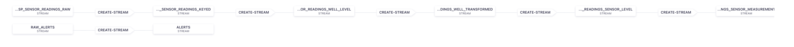
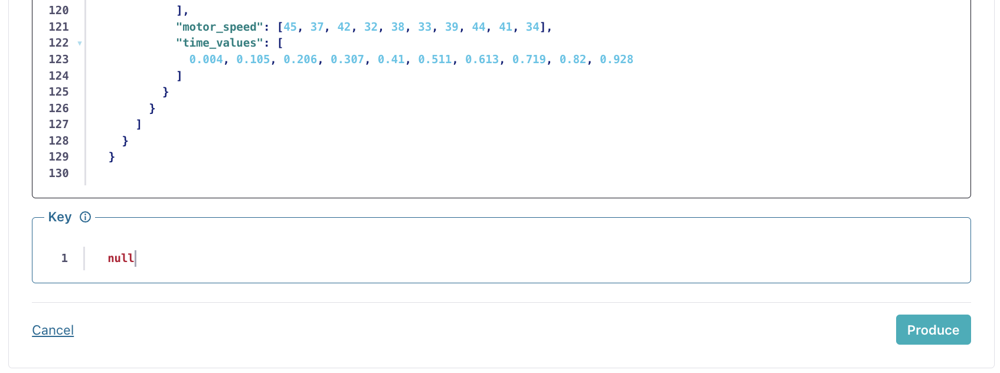
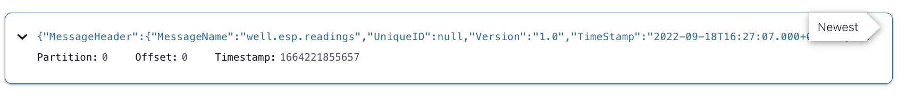

# IoT Use Case: Drilling Machine Stream Processing (Confluent Cloud)

We want to build a dataflow based on events of oil drilling equipment.\
Events are emitted by a DEMS (Drilling Equipment Management System) which collects information on the status of the drillhead during drilling.\ At certain points during this process, a collection of this information is emitted as a complex event for subsequent analysis (not in scope of this exercise)\

Our data pipeline should look like this:


## 0 Setup : Confluent Cloud, Kafka and ksqlDB cluster.

- Login to Confluent Cloud.
- Select environment "ksqldb-workshop"
- Create new cluster or select an existing one.
- From the left panel select "ksqlDB" to display all apps.
- Select your ksqlDB cluster to display the ksqlDB Editor.


## 1. Define data of interest

Create a stream including the backing topic and specify the data of interest for our data flow.

Note: \
All following statements will auto-create topics. The auto-creation of topics only works, if the AuthZ for the security principal of the ksqlDB cluster is setup correctly. \
If you created your ksqlDB cluster with 'Global Access', all is fine. \
If you created your cluster with 'Granular Access' you might need to execute statements along the line:

```
confluent kafka acl create --allow --service-account <YOUR_SERVICE_ACCOUNT_RESOURCE_ID> --operation CREATE --topic 'well' --prefix
confluent kafka acl create --allow --service-account <YOUR_SERVICE_ACCOUNT_RESOURCE_ID> --operation READ --operation WRITE --topic 'well' --prefix
```

Now let's create the first stream

```
CREATE STREAM WELL_ESP_SENSOR_READINGS_RAW (
`MessageHeader` STRUCT<`MessageName` VARCHAR, `TimeStamp` VARCHAR>,\
`ProcessData` STRUCT<`reservoir_code` VARCHAR, `equipment_type` VARCHAR, `date` STRING,\
`wells` ARRAY<STRUCT<`well_name` VARCHAR, `equipment_nr` VARCHAR, `equipment_installation_depth` INT,\
`sensor_readings` STRUCT<`bottomhole_pressure` ARRAY<INT>, `bottomhole_temp` ARRAY<DOUBLE>,`motor_current` ARRAY<DOUBLE>, `motor_speed` ARRAY<DOUBLE>, `time_values` ARRAY<DOUBLE>>>>>
) WITH (KAFKA_TOPIC='well.equipment.esp.sensor.readings-raw', VALUE_FORMAT='JSON', PARTITIONS='1');

```

## 2 Introduce a unique ID
Introduce an artifical unique ID for the given event.\
This can be used at a later stage in a downstream system to correlate subsequent individual events that  originate in this initial given event.
```
CREATE OR REPLACE STREAM WELL_ESP_SENSOR_READINGS_KEYED WITH (KAFKA_TOPIC='well.equipment.esp.sensor.readings-keyed', VALUE_FORMAT='JSON', KEY_FORMAT='KAFKA', PARTITIONS='2' ) as \
select UUID() as PROCESS_EVENT_UID, * \
from WELL_ESP_SENSOR_READINGS_RAW emit changes;
```

## 3 Explode the list of drilling machines
Each event holds information about a set of drilling equipment.\
Create a new event for each drilling equipment.

```
CREATE OR REPLACE STREAM WELL_ESP_SENSOR_READINGS_WELL_LEVEL WITH (KAFKA_TOPIC='well.equipment.esp.sensor.readings-per-well',VALUE_FORMAT='JSON', KEY_FORMAT='KAFKA', PARTITIONS='2' ) as \
select UUID() as PROCESS_EVENT_UID, `ProcessData`->`date` as PROCESS_DATE, EXPLODE(`ProcessData`->`wells`) as WELL \
from WELL_ESP_SENSOR_READINGS_KEYED emit changes;
```

## 4 Simple transformations + synthetic index
Apply a few simple transformations (given datetime to a standardized timestamp, rename of attributes)\
Also create a new integer array with the length of the time-series.
```
CREATE OR REPLACE STREAM WELL_ESP_SENSOR_READINGS_WELL_TRANSFORMED WITH (KAFKA_TOPIC='well.equipment.esp.sensor.readings-well-transformed',VALUE_FORMAT='JSON', KEY_FORMAT='KAFKA', PARTITIONS='2' ) as \
select PROCESS_EVENT_UID, PROCESS_DATE, STRINGTOTIMESTAMP(PROCESS_DATE,'yyyy-MM-dd HH:mm:ss') AS PROCESS_TIMESTAMP,
WELL->`well_name` as WELL_NAME, WELL->`equipment_nr` as EQUIPMENT_ID, \
WELL->`sensor_readings`->`bottomhole_pressure`, \
WELL->`sensor_readings`->`bottomhole_temp`, \
WELL->`sensor_readings`->`motor_current`, \
WELL->`sensor_readings`->`motor_speed`, \
WELL->`sensor_readings`->`time_values`, \
GENERATE_SERIES(0,ARRAY_LENGTH(WELL->`sensor_readings`->`bottomhole_pressure`)) AS SENSOR_READING_SERIE_INDEX \
from WELL_ESP_SENSOR_READINGS_WELL_LEVEL emit changes;

```

## 5 Explode the time series
Explode each array for 
*the four measurement values
*the delta time of each measurement
*the previously generated synthetic index
```
CREATE OR REPLACE STREAM WELL_ESP_SENSOR_READINGS_SENSOR_LEVEL WITH (KAFKA_TOPIC='well.equipment.esp.sensor.readings-sensor-level',VALUE_FORMAT='JSON', KEY_FORMAT='KAFKA', PARTITIONS='2' ) as \
select PROCESS_EVENT_UID, PROCESS_DATE, PROCESS_TIMESTAMP, WELL_NAME, EQUIPMENT_ID, \
EXPLODE(`bottomhole_pressure`) as MEASUREMENT_BOTTOMHOLE_PRESSURE, \
EXPLODE(`bottomhole_temp`) as MEASUREMENT_BOTTOMHOLE_TEMP, \
EXPLODE(`motor_current`) as MEASUREMENT_MOTOR_CURRENT, \
EXPLODE(`motor_speed`) as MEASUREMENT_MOTOR_SPEED, \
EXPLODE(`time_values`) as SERIE_VALUE_TIME, \
EXPLODE(SENSOR_READING_SERIE_INDEX) AS MEASUREMENT_INDEX \
from WELL_ESP_SENSOR_READINGS_WELL_TRANSFORMED emit changes;
```

## 6 Create timestamp for each element in the timeseries
Each individual measurement only knows about its delta wrt. the start.\
It is benefitial for subsequent analysis, if each event carries its own absolute time information
```
CREATE OR REPLACE STREAM WELL_ESP_SENSOR_READINGS_SENSOR_MEASUREMENT WITH (KAFKA_TOPIC='well.equipment.esp.sensor.readings-measurement-timestamp',VALUE_FORMAT='JSON', KEY_FORMAT='KAFKA', PARTITIONS='2' ) as \
select PROCESS_EVENT_UID, PROCESS_DATE, PROCESS_TIMESTAMP, WELL_NAME, EQUIPMENT_ID, \
(EQUIPMENT_ID+'-'+CAST(MEASUREMENT_INDEX AS STRING)) as MEASUREMENT_ID, \
MEASUREMENT_BOTTOMHOLE_PRESSURE, MEASUREMENT_BOTTOMHOLE_TEMP, MEASUREMENT_MOTOR_CURRENT, MEASUREMENT_MOTOR_SPEED, SERIE_VALUE_TIME, \
CAST(PROCESS_TIMESTAMP+1000.*SERIE_VALUE_TIME AS BIGINT) AS MEASUREMENT_TIMESTAMP, \
TIMESTAMPTOSTRING(CAST(PROCESS_TIMESTAMP+1000.*SERIE_VALUE_TIME AS BIGINT),'yyyy-MM-dd HH:mm:ss:SSS','UTC') AS MEASUREMENT_TIMESTAMP_UTC, \
MEASUREMENT_INDEX \
from WELL_ESP_SENSOR_READINGS_SENSOR_LEVEL emit changes;

```

We can insert sample data into our created topic from within the confluent ui as follows:



The final topic 'well.equipment.esp.sensor.readings-measurement-timestamp' would then hold data like:



```
{ "PROCESS_EVENT_UID": "c1b11a22-0ef4-4577-869d-043203a9205e", "PROCESS_DATE": "2022-09-18 16:27:07", "PROCESS_TIMESTAMP": 1619533002000, in I'll"WELL_NAME": "FGHN-21", "EQUIPMENT_ID": "10968", "MEASUREMENT_ID":"10968-1", "MEASUREMENT_BOTTOMHOLE_PRESSURE": 920, "MEASUREMENT_BOTTOMHOLE_TEMP": 265.0, "MEASUREMENT_MOTOR_CURRENT": 5.48, "MEASUREMENT_MOTOR_SPEED": 31, "MEASUREMENT_TIMESTAMP": 1619533002002, "MEASUREMENT_TIMESTAMP_UTC": "2022-09-18 16:27:07:002", "MEASUREMENT_INDEX": 1}

```
## Bonus
We introduced a subtle flaw in our data flow logic.\
Can you find it?\
Which modification is required to improve the data flow?\
Hint: Check the arrays and their values as well as the multiplicity of events at each step above\
What other improvements can you imagine?

END Pump Stream Processing Lab.

[Back](../README.md#Agenda) to Agenda.
