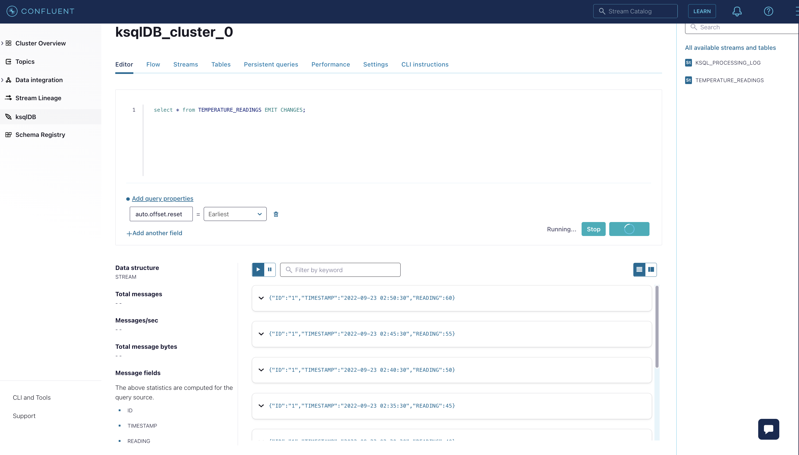

# Internet of Things Use Case: Temperature Alerting System (Confluent Cloud)

We build an alerting system that automatically detects if the temperature of a room consistently drops.
The program will monitors a stream of temperature readings and detects when the temperature
consistently drops below a given value for a period of 10 minutes.

Our data pipeline should look like this:


## 0 Setup : Confluent Cloud, Kafka and ksqlDB cluster.

- Login to Confluent Cloud.
- Select or create an environment.
- Create new ksqlDB cluster or select an existing from within your environment.
- Select "ksqlDB" from your left panel to display all ksqlDb clusters.
- Select a ksqlDB cluster to display ksqlDB editor.

Our final data pipeline look like this:


## 1. Create stream (TEMPERATURE_READINGS).

To start off the implementation of this scenario, you need to create a stream that represents the temperature readings coming from the sensors.
The stream creation script below auto creates a topic.

Note: Auto creation of topics only work, if the AuthZ is setup.

E.g. For our timeseries demo, we need to execute:

```
confluent kafka acl create --allow --service-account <sa-1jqw3z> --operation CREATE
confluent kafka acl create --allow --service-account <sa-1jqw3z> --operation READ --operation WRITE
```

```
CREATE STREAM TEMPERATURE_READINGS (ID VARCHAR KEY, TIMESTAMP VARCHAR, READING BIGINT)
    WITH (KAFKA_TOPIC = 'TEMPERATURE_READINGS',
          VALUE_FORMAT = 'JSON',
          TIMESTAMP = 'TIMESTAMP',
          TIMESTAMP_FORMAT = 'yyyy-MM-dd HH:mm:ss',
          PARTITIONS = 1);
```

Check created stream and topic from stream and topic tabs within your cloud UI.

## 2. Now let’s produce some events that represent temperature readings from a sensor.

Note how the timestamps are increasing on intervals of 5 minutes, to indicate that the sensor emits those events every 5 minutes.

```
INSERT INTO TEMPERATURE_READINGS (ID, TIMESTAMP, READING) VALUES ('1', '2022-09-23 02:15:30', 55);
INSERT INTO TEMPERATURE_READINGS (ID, TIMESTAMP, READING) VALUES ('1', '2022-09-23 02:20:30', 50);
INSERT INTO TEMPERATURE_READINGS (ID, TIMESTAMP, READING) VALUES ('1', '2022-09-23 02:25:30', 45);
INSERT INTO TEMPERATURE_READINGS (ID, TIMESTAMP, READING) VALUES ('1', '2022-09-23 02:30:30', 40);
INSERT INTO TEMPERATURE_READINGS (ID, TIMESTAMP, READING) VALUES ('1', '2022-09-23 02:35:30', 45);
INSERT INTO TEMPERATURE_READINGS (ID, TIMESTAMP, READING) VALUES ('1', '2022-09-23 02:40:30', 50);
INSERT INTO TEMPERATURE_READINGS (ID, TIMESTAMP, READING) VALUES ('1', '2022-09-23 02:45:30', 55);
INSERT INTO TEMPERATURE_READINGS (ID, TIMESTAMP, READING) VALUES ('1', '2022-09-23 02:50:30', 60);

```

Our topic and stream entries should look like this:




Please make sure your auto.offset.reset is set to Earliest as above.

## 3 Query detect when temperatures drops below a given value for a period of 10 minutes.

We need to create a query capable of detecting when the temperature drops below a given value for a period of 10 minutes.
However, since our sensor emits readings every 5 minutes, we need to come up with a way to detect this even
if the drop goes beyond the interval of 10 minutes. Hence why we are using hopping windows for this scenario.

```
SELECT
    ID,
    TIMESTAMPTOSTRING(WINDOWSTART, 'HH:mm:ss', 'UTC') AS START_PERIOD,
    TIMESTAMPTOSTRING(WINDOWEND, 'HH:mm:ss', 'UTC') AS END_PERIOD,
    SUM(READING)/COUNT(READING) AS AVG_READING
  FROM TEMPERATURE_READINGS
    WINDOW HOPPING (SIZE 10 MINUTES, ADVANCE BY 5 MINUTES)
  GROUP BY ID
  HAVING SUM(READING)/COUNT(READING) < 45
  EMIT CHANGES
  LIMIT 3;

```

Our query produces following output


Enter following command to list all existing streams:

### 4.1 Create Table (TRIGGERED_ALERTS)

Now let’s create some continuous queries to implement this scenario.

Hopping windows may overlap, thus if the temperature dropped for 10 minutes
but the drop was kept up to 5 minutes beyond an given window — the query will be able to detect that as well.

```
CREATE TABLE TRIGGERED_ALERTS WITH (KAFKA_TOPIC='TRIGGERED_ALERTS', PARTITIONS=1) AS
    SELECT
        ID AS KEY,
        AS_VALUE(ID) AS ID,
        TIMESTAMPTOSTRING(WINDOWSTART, 'HH:mm:ss', 'UTC') AS START_PERIOD,
        TIMESTAMPTOSTRING(WINDOWEND, 'HH:mm:ss', 'UTC') AS END_PERIOD,
        SUM(READING)/COUNT(READING) AS AVG_READING
    FROM TEMPERATURE_READINGS
      WINDOW HOPPING (SIZE 10 MINUTES, ADVANCE BY 5 MINUTES)
    GROUP BY ID
    HAVING SUM(READING)/COUNT(READING) < 45;

```

### 4.2 Create stream (STREAM RAW_ALERTS)

```
CREATE STREAM RAW_ALERTS (ID VARCHAR, START_PERIOD VARCHAR, END_PERIOD VARCHAR, AVG_READING BIGINT)
    WITH (KAFKA_TOPIC = 'TRIGGERED_ALERTS',
          VALUE_FORMAT = 'JSON');

```

### 4.3 Create Stream (ALERTS)

Note that we called the query that detects the temperature drop as TRIGGERED_ALERTS and we modeled as a table,
since we are performing some aggregations in the query. But just like the temperature readings,
alerts can happen continuously – therefore we transform the table back to a stream so we can have multiple alerts throughout time.

```

CREATE STREAM ALERTS AS
    SELECT
        ID,
        START_PERIOD,
        END_PERIOD,
        AVG_READING
    FROM RAW_ALERTS
    WHERE ID IS NOT NULL
    PARTITION BY ID;

```

## 5. Select alerts within time window.

```

SELECT
    ID,
    START_PERIOD,
    END_PERIOD,
    AVG_READING
FROM ALERTS
EMIT CHANGES
LIMIT 3;

```

The output should look similar to:


END Temperature Alerting System Lab.

[Back](../README.md#Agenda) to Agenda.
