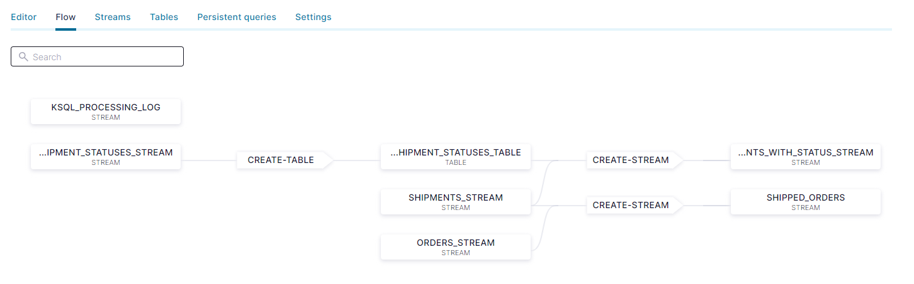
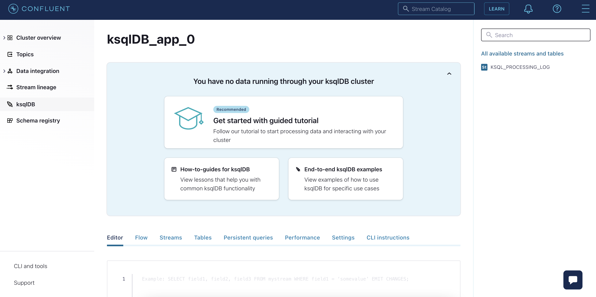
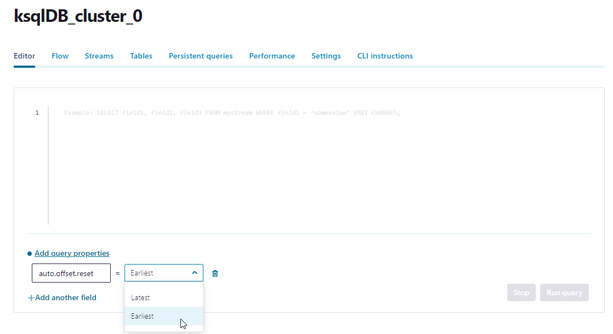

# Logistics case: Track and Trace (steps for Confluent Cloud)

We are going to build data pipeline which should look like this:



## 1. First Steps
- Login to Confluent Cloud. 
- Select your environment and your cluster. 
- From the left panel select "ksqlDB" to display all apps. 
- Select your ksqlDB cluster to display the ksqlDB Editor. 



## 2. Create Streams, Topics and Table

Please set the following query property to set ksqlDB to query data from the beginning of the topic.
* `auto.offset.reset` to 'Earliest'



Create the stream "orders_stream" and a new topic called "orders".
```
CREATE STREAM orders_stream (
			orderid VARCHAR key,
			order_ts VARCHAR,
			shop VARCHAR,
			product VARCHAR,
			order_placed VARCHAR,
			total_amount DOUBLE,
			customer_name VARCHAR)
		with (KAFKA_TOPIC='orders',
		      VALUE_FORMAT='JSON',
              KEY_FORMAT='KAFKA', 
              PARTITIONS=1,
		      TIMESTAMP='order_ts',
		      TIMESTAMP_FORMAT='yyyy-MM-dd''T''HH:mm:ssX');
```

Check your creation with describe:
```
describe orders_stream;
```

Create some demo data for the stream "orders_stream":
```
insert into orders_stream (orderid, order_ts, shop, product, order_placed, total_amount, customer_name) values ('1', '2022-03-16T11:58:25Z', 'Otto', 'iPhoneX', 'BERLIN', 462.11, 'Max Muster');

insert into orders_stream (orderid, order_ts, shop, product, order_placed, total_amount, customer_name) values ('2', '2022-03-16T12:58:25Z', 'Apple', 'MacBookPro13', 'BERLIN', 3462.11, 'Max Muster');

insert into orders_stream (orderid, order_ts, shop, product, order_placed, total_amount, customer_name) values ('3', '2022-03-16T13:58:25Z', 'Amazon', 'Apple Pencil', 'BERLIN', 62.11, 'Max Muster');
```

Check topic and stream data (they are identical for now)
```
print 'orders' from beginning;
select * from orders_stream emit changes;
```

Create a new stream called "shipments_stream" and a new topic "shipments":
```
CREATE STREAM shipments_stream (
				shipmentid varchar key,
				shipment_id VARCHAR,
				shipment_ts VARCHAR,
				order_id VARCHAR,
				delivery VARCHAR)
			with (KAFKA_TOPIC='shipments',
           KEY_FORMAT='KAFKA', 
           PARTITIONS=1,
			     VALUE_FORMAT='JSON',
			     TIMESTAMP='shipment_ts',
			     TIMESTAMP_FORMAT='yyyy-MM-dd''T''HH:mm:ssX');
```

Create some demo data for the stream "shipments_stream":
```
insert into shipments_stream (shipmentid, shipment_id, shipment_ts, order_id, delivery) values ('ship-ch83360', 'ship-ch83360', '2022-03-16T12:13:39Z', '1', 'UPS');

insert into shipments_stream (shipmentid, shipment_id, shipment_ts, order_id, delivery) values ('ship-xf72808', 'ship-xf72808', '2022-03-16T13:04:13Z', '2', 'DHL');

insert into shipments_stream (shipmentid, shipment_id, shipment_ts, order_id, delivery) values ('ship-kr47454', 'ship-kr47454', '2022-03-16T14:13:39Z', '3', 'HERMES');
```

Create a new stream called "shipped_orders" that joins data from the "orders_stream" and "shipments_stream":
```
CREATE STREAM shipped_orders AS
	SELECT
		o.orderid AS order_id,
		TIMESTAMPTOSTRING(o.rowtime, 'yyyy-MM-dd HH:mm:ss') AS order_ts,
		o.total_amount,
		o.customer_name,
		s.shipment_id,
		TIMESTAMPTOSTRING(s.rowtime, 'yyyy-MM-dd HH:mm:ss') AS shipment_ts,
		s.delivery, 
		(s.rowtime - o.rowtime) / 1000 / 60 AS ship_time
	FROM
		orders_stream o 
  INNER JOIN shipments_stream s
	WITHIN
		30 DAYS GRACE PERIOD 45 DAYS
	ON
		o.orderid = s.order_id;
```

Knowledge questions:
- What does the 30 days limit actually mean? Which time does this apply to?
- Also, any idea where the properties o.rowtime and s.rowtime in the upper statement are coming from and what do you think about its values?

Optional: Check topic and stream data
```
describe shipped_orders;
select * from shipped_orders emit changes;
```

Create a new stream called "shipment_statuses_stream" and a new topic "shipment_status":
```
CREATE STREAM shipment_statuses_stream (
			shipment_id VARCHAR,
			status VARCHAR,
			warehouse VARCHAR)
		WITH (KAFKA_TOPIC='shipment_status',
          KEY_FORMAT='KAFKA', 
          PARTITIONS=1, 
		      VALUE_FORMAT='JSON');
```

Create some demo data for the stream "shipment_statuses_stream":
```
insert into shipment_statuses_stream (shipment_id, status, warehouse) values ('ship-kr47454', 'in delivery', 'FRANKFURT');

insert into shipment_statuses_stream (shipment_id, status, warehouse) values ('ship-kr47454', 'in delivery', 'BERLIN');

insert into shipment_statuses_stream (shipment_id, status, warehouse) values ('ship-kr47454', 'delivered', '@customer');

insert into shipment_statuses_stream (shipment_id, status, warehouse) values ('ship-ch83360', 'in delivery', 'BERLIN');

insert into shipment_statuses_stream (shipment_id, status, warehouse) values ('ship-ch83360', 'in delivery', 'FRANKFURT');

insert into shipment_statuses_stream (shipment_id, status, warehouse) values ('ship-ch83360', 'delivered', 'Customer_Street');
```

Verify the entries:
```
select * from shipment_statuses_stream emit changes;
```

Create a table with aggregation functions over the stream "shipment_statuses_stream" that supports **symmetric updates**
```
CREATE TABLE shipment_statuses_table AS
	SELECT
		shipment_id,
		histogram(status) as status_counts,
		collect_list('{ "status" : "' + status + '"}') as status_list,
		histogram(warehouse) as warehouse_counts,
		collect_list('{ "warehouse" : "' + warehouse + '"}') as warehouse_list
	FROM
		shipment_statuses_stream
	WHERE
		status is not null
	GROUP BY
		shipment_id;
```

Have a look into the table:
```
select * from shipment_statuses_table emit changes;
select * from shipment_statuses_table where SHIPMENT_ID='ship-ch83360';
```

Knowledge question:
- Is there a topic for this table? 
- What is the name of the topic?
- Get an overview with: `list topics;`

Troubleshoot:
```
list tables; 
list streams;
describe streams;      
```

END of Track & Trace Lab.

[Back](../README.md#Agenda) to Agenda.
