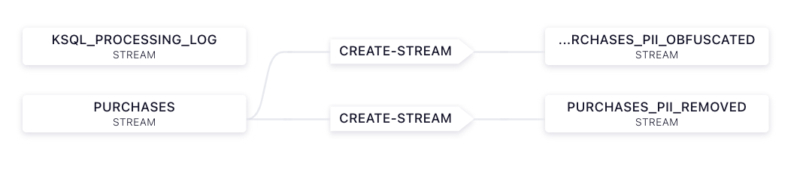
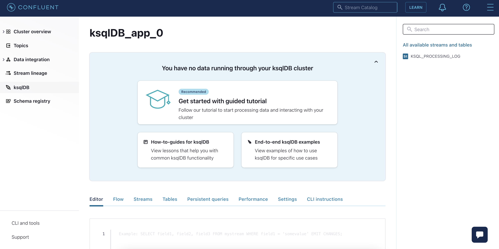

# Retail and Logistic case: Masking PII Data (steps for Confluent Cloud)


We are going to build data pipeline which should look like this:


## 1. First Steps
Login to Confluent Cloud. Select environment "ksqldb-workshop" and then select your Cluster. From the left panel select "ksqlDB" to display all apps. Select your ksqlDB cluster to display the ksqlDB Editor. 




## 2. Create Streams 

Suppose you have a topic that contains personally identifiable information (PII), and you want to mask those fields. In this tutorial, we'll write a program that persists the events in the original topic to a new Kafka topic with the PII removed or obfuscated.

First, you’ll need to create a Kafka topic and stream to represent the purchases data. The following creates both in one shot.

Enter following commands (click button "Run query" for each command):

```
CREATE STREAM purchases (order_id INT, customer_name VARCHAR, date_of_birth VARCHAR,
                         product VARCHAR, order_total_usd DOUBLE, town VARCHAR, country VARCHAR)
    WITH (kafka_topic='purchases', value_format='json', partitions=1);
```


## 3. Insert Data to Streams

In the ksqlDB Editor add some data to your streams.

purchase data using the following commands:
```
INSERT INTO purchases (order_id, customer_name, date_of_birth, product, order_total_usd, town, country) VALUES (1, 'Britney', '02/29/2000', 'Heart Rate Monitor', 119.93, 'Denver', 'USA');
INSERT INTO purchases (order_id, customer_name, date_of_birth, product, order_total_usd, town, country) VALUES (2, 'Michael', '06/08/1981', 'Foam Roller', 34.95, 'Los Angeles', 'USA');
INSERT INTO purchases (order_id, customer_name, date_of_birth, product, order_total_usd, town, country) VALUES (3, 'Kimmy', '05/19/1978', 'Hydration Belt', 50.00, 'Tuscan', 'USA');
INSERT INTO purchases (order_id, customer_name, date_of_birth, product, order_total_usd, town, country) VALUES (4, 'Samantha', '08/05/1983', 'Wireless Headphones', 175.93, 'Tulsa', 'USA');
INSERT INTO purchases (order_id, customer_name, date_of_birth, product, order_total_usd, town, country) VALUES (5, 'Jonathon', '01/31/1981', 'Comfort Insoles', 49.95, 'Portland', 'USA');
INSERT INTO purchases (order_id, customer_name, date_of_birth, product, order_total_usd, town, country) VALUES (6, 'Raymond', '07/29/2001', 'Running Beanie', 13.73, 'Omaha', 'USA');
```


## 4. Verify the entered data

Please set the following query properties 
* 'auto.offset.reset' to 'earliest'
to query your streams and table


Now we should be able to see all of the purchases data we just entered with the following command:


```
SELECT *
    FROM purchases
    EMIT CHANGES
    LIMIT 6;
```
This should yield roughly the following output. The order will be different depending on how the records were actually inserted. Note that PII like name, birthdate, city, and country are present.

```bash
+--------------------+--------------------+--------------------+--------------------+--------------------+--------------------+--------------------+
|ORDER_ID            |CUSTOMER_NAME       |DATE_OF_BIRTH       |PRODUCT             |ORDER_TOTAL_USD     |TOWN                |COUNTRY             |
+--------------------+--------------------+--------------------+--------------------+--------------------+--------------------+--------------------+
|1                   |Britney             |02/29/2000          |Heart Rate Monitor  |119.93              |Denver              |USA                 |
|2                   |Michael             |06/08/1981          |Foam Roller         |34.95               |Los Angeles         |USA                 |
|3                   |Kimmy               |05/19/1978          |Hydration Belt      |50.0                |Tuscan              |USA                 |
|4                   |Samantha            |08/05/1983          |Wireless Headphones |175.93              |Tulsa               |USA                 |
|5                   |Jonathon            |01/31/1981          |Comfort Insoles     |49.95               |Portland            |USA                 |
|6                   |Raymond             |07/29/2001          |Running Beanie      |13.73               |Omaha               |USA                 |
Limit Reached
Query terminated
```

## 5. Handle PII Data

Next we will highlight two ways to mask PII data, both methods will result in new streams.
Our first masking technique will be to create a derived topic in which all PII is excluded. This technique masks data by refraining from pulling in PII fields like CUSTOMER_NAME and DATE_OF_BIRTH.


```
CREATE STREAM purchases_pii_removed
    WITH (kafka_topic='purchases_pii_removed', value_format='json', partitions=1) AS
    SELECT ORDER_ID, PRODUCT, ORDER_TOTAL_USD, TOWN, COUNTRY
    FROM PURCHASES;
```
Let’s verify that the derived topic we just created does not have any PII related to CUSTOMER_NAME or DATE_OF_BIRTH. You can see the contents of the stream by executing the following:

```
SELECT *
    FROM purchases_pii_removed
    EMIT CHANGES
    LIMIT 6;
```

Your results should look like what is below. Take note of the lack of PII fields like CUSTOMER_NAME or DATE_OF_BIRTH.

```
+--------------------+--------------------+--------------------+--------------------+--------------------+
|ORDER_ID            |PRODUCT             |ORDER_TOTAL_USD     |TOWN                |COUNTRY             |
+--------------------+--------------------+--------------------+--------------------+--------------------+
|1                   |Heart Rate Monitor  |119.93              |Denver              |USA                 |
|2                   |Foam Roller         |34.95               |Los Angeles         |USA                 |
|3                   |Hydration Belt      |50.0                |Tuscan              |USA                 |
|4                   |Wireless Headphones |175.93              |Tulsa               |USA                 |
|5                   |Comfort Insoles     |49.95               |Portland            |USA                 |
|6                   |Running Beanie      |13.73               |Omaha               |USA                 |
Limit Reached
Query terminated
```
The second technique for masking data utilizes ksqlDB’s built in MASK functions. Here we retain the customer name and date of birth, but obfuscated.

```
CREATE STREAM purchases_pii_obfuscated
    WITH (kafka_topic='purchases_pii_obfuscated', value_format='json', partitions=1) AS
    SELECT MASK(CUSTOMER_NAME) AS CUSTOMER_NAME,
           MASK(DATE_OF_BIRTH) AS DATE_OF_BIRTH,
           ORDER_ID, PRODUCT, ORDER_TOTAL_USD, TOWN, COUNTRY
    FROM PURCHASES;
```

Use the command below to query the contents of the purchases_pii_obfuscated stream:

```
SELECT *
    FROM purchases_pii_obfuscated
    EMIT CHANGES
    LIMIT 6;
```

We can see that the sensitive data is masked with x’s or n’s.

```

+--------------------+--------------------+--------------------+--------------------+--------------------+--------------------+--------------------+
|CUSTOMER_NAME       |DATE_OF_BIRTH       |ORDER_ID            |PRODUCT             |ORDER_TOTAL_USD     |TOWN                |COUNTRY             |
+--------------------+--------------------+--------------------+--------------------+--------------------+--------------------+--------------------+
|Xxxxxxx             |nn-nn-nnnn          |1                   |Heart Rate Monitor  |119.93              |Denver              |USA                 |
|Xxxxxxx             |nn-nn-nnnn          |2                   |Foam Roller         |34.95               |Los Angeles         |USA                 |
|Xxxxx               |nn-nn-nnnn          |3                   |Hydration Belt      |50.0                |Tuscan              |USA                 |
|Xxxxxxxx            |nn-nn-nnnn          |4                   |Wireless Headphones |175.93              |Tulsa               |USA                 |
|Xxxxxxxx            |nn-nn-nnnn          |5                   |Comfort Insoles     |49.95               |Portland            |USA                 |
|Xxxxxxx             |nn-nn-nnnn          |6                   |Running Beanie      |13.73               |Omaha               |USA                 |
Limit Reached
Query terminated
```


Now check in Confluent Cloud UI:
* check in ksqlDB Cluster - the persistent queries. Take a look in the details (SINK: and SOURCE:) of the running queries.
* check performance tab if everything running without problems
* check in ksqlDB cluster the flow to follow the expansion easier. If it is not visible refresh the webpage in browser.


Please also check the new tabs
* Performance: Do check roll-over over CSU saturation (%) (i) sign
* setting: See that we running only one endpoint, so one instance, no HA. And also which API key is running with ksqDB APP. How to do you know, which ACL this API key has?
  * answer: `confluent api-key list |  grep KEY` is running for a cloud user `confluent kafka acl list | grep USER` and which role are aligned `confluent iam rbac role-binding list --principal User:u-xxxx`
* CLI instruction: Try to connect the Confluent Cloud ksqlDB cluster via the ksql cli described in that tab.


## 6. Merge the status streams
```
# We do a union all here
CREATE STREAM payment_statuses AS SELECT payment_id, status, 'AML' as source_system FROM aml_status;

INSERT INTO payment_statuses SELECT payment_id, status, 'FUNDS' as source_system FROM funds_status;

describe payment_statuses;

select * from payment_statuses emit changes;
```
This is the standard way to merge streams into one. Please also check this sample from our [devloper page](https://developer.confluent.io/tutorials/merge-many-streams-into-one-stream/ksql.html)

Combine payment and status events in 1 hour window. Why we need a timing window for stream-stream join? Please follow the documentation [here](https://docs.ksqldb.io/en/latest/developer-guide/joins/join-streams-and-tables/#join-capabilities) to answer this question.
```
CREATE STREAM payments_with_status AS SELECT
  ep.payment_id as payment_id,
  ep.accountid,
  ep.amount,
  ep.bank,
  ep.first_name,
  ep.last_name,
  ep.email,
  ep.status360,
  ps.status,
  ps.source_system
  FROM enriched_payments ep LEFT JOIN payment_statuses ps WITHIN 1 HOURS ON ep.payment_id = ps.payment_id ;

describe payments_with_status;

select * from payments_with_status emit changes;
```
## 7. Aggregate data to the final table

Aggregate into consolidated records
```
CREATE TABLE payments_final AS SELECT
  payment_id,
  histogram(status) as status_counts,
  collect_list('{ "system" : "' + source_system + '", "status" : "' + STATUS + '"}') as service_status_list
  from payments_with_status
  where status is not null
  group by payment_id;

describe PAYMENTS_FINAL ;

select * from payments_final emit changes;
```


Pull queries, check value for a specific payment (snapshot lookup). Pull Query is a Preview feature.
```
select * from payments_final where payment_id=1;
```

## 8. Query by REST Call
Get the REST Endpoint from the Settings menu and execute query with your credentials copies from properties File


Test REST API access
```
curl -u KEY:SECRET https://yourserver.gcp.confluent.cloud:443/info
```
List streams via curl
```
curl -X "POST" "https://yourserver.europe-west1.gcp.confluent.cloud:443/ksql" \
     -u KEY:SECRET \
     -H "Content-Type: application/vnd.ksql.v1+json; charset=utf-8" \
     -d $'{"ksql": "LIST STREAMS;","streamsProperties": {}}' | jq        
```
Try Select query via REST API
```
curl -X "POST" "https://yourserver.europe-west1.gcp.confluent.cloud:443/query-stream" \
     -u KEY:SECRET \
     -H "Content-Type: application/vnd.ksql.v1+json; charset=utf-8" \
     -d $'{"sql": "select * from payments_final where payment_id=1;","streamsProperties": {}}' | jq
```
END Lab 1 

Final table with payment statuses


[go back to Agenda](https://github.com/ora0600/confluent-ksqldb-hands-on-workshop/blob/master/README.md#hands-on-agenda-and-labs)
